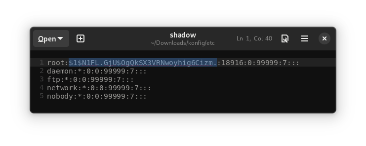

# ZTE MF258 router SSH access

Guide on how to access SSH on the ZTE router

Attention! You do so at your own risk

## Step 1
Login to WebInterface (192.168.1.1) and download `Backup Configuration File`


## Step 2
Change name file:
```
mv config.cfg config.gz
```

Extract file:
```
gzip -d config.gz
```

Extract the file again
```
tar -xf config
``` 

## Step 3
Open `etc/shadow` and copy hash root (example on screenshot):


  
and paste the copied hash into the page https://www.tunnelsup.com/hash-analyzer/ and copy the `salt`:


## Step 4

Create a new hash:
```
openssl passwd -1 -salt <salt from Step 3> <new password>
```

Example:


## Step 5
Paste new hash in place of old hash in the `etc/shadow`:



## Step 6
Create a new archive:
```
rm config
tar -cf config etc/ www/
gzip config
mv config.gz config.cfg
```

## Step 7
Upload a new configuration file on the WebInterface:


## Step 8

Connect to router SSH with your new password:

```
ssh root@192.168.1.1
```
